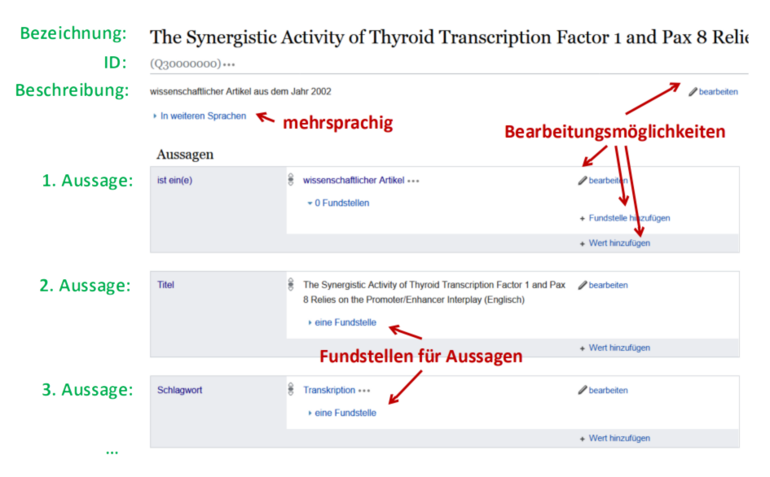
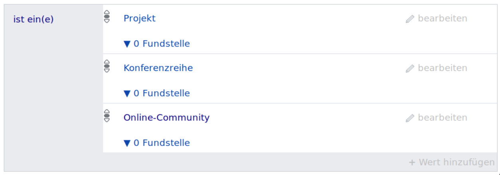
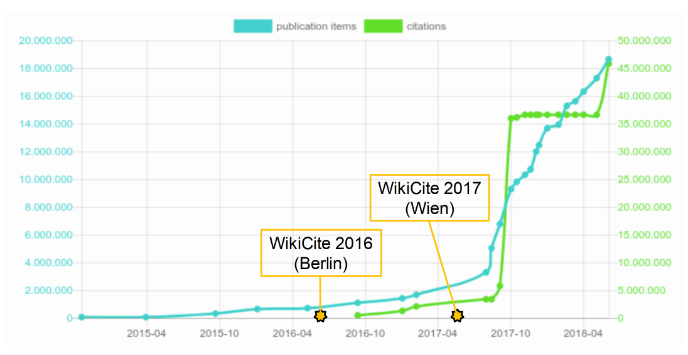
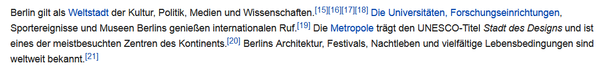
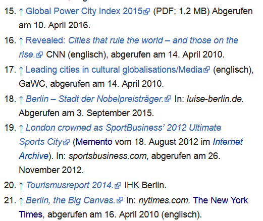
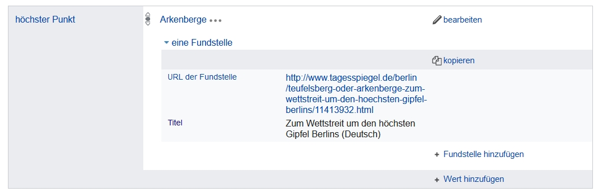
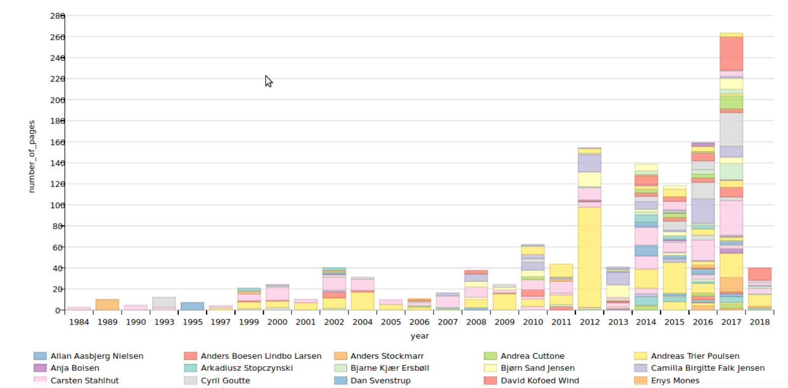
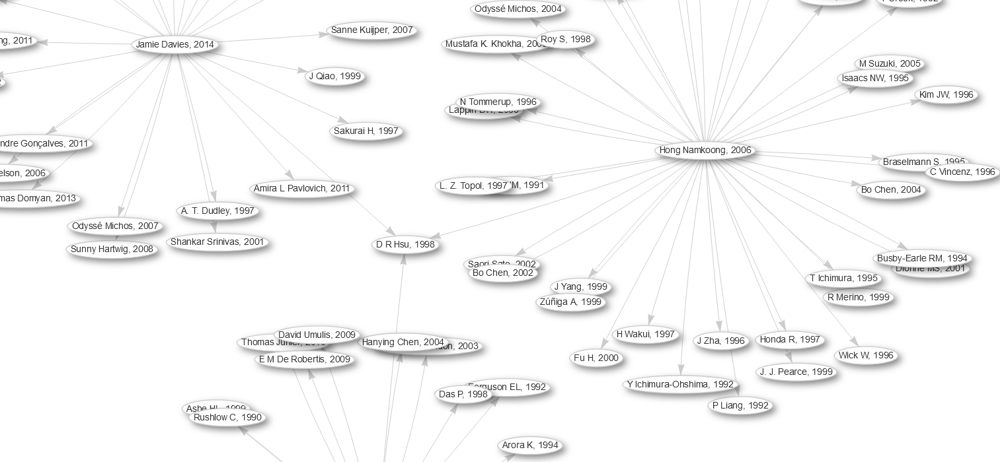

# Hintergrund

## Begriffsklärung

Wikipedia
  : Enzyklopädie in Form eines offenen Wikis

Wikidata
  : Datenbank in Form eines Wikis

Wikimedia
  : Organisation & Community

Wikibase
  : Erweiterung der Wiki-Software für Wikidata

WikiCite
  : ???

## Wikidata

* Offene Datenbank in Form eines Wikis
* Geburtstag am 29. Oktober 2012!
* Wissensdatenbank und Normdatei für Wikidata u.v.a.m.
* Basiert auf Software Wikibase

Beispieldatensatz: [Q564783](http://www.wikidata.org/entity/Q564783) (SUB Göttingen)

## Wikibase-Datenmodell

* Item-Identifier 
    - [Q30000000](http://www.wikidata.org/entity/Q30000000)

* Eigenschaften
    - [P31](http://www.wikidata.org/entity/Q31) *ist ein(e) / instance of / est ...*
    - [P50](http://www.wikidata.org/entity/P50) *Autor / author / scriptor ...*
    - ...

* Qualifikatoren & Belege

* Constraints als Aussagen über Eigenschaften (optional!)

---

{width=95%}

## Wikibase

* Wikisoftware für Wissensdatenbanken, insbesondere Wikidata

* Ontologie (Eigenschaften & Constraints) als Teil des Wiki

* APIs und Programmbibliotheken

* Zunehmend auch zur Erfassung in GLAM-Einrichtungen

    * [FactGrid](https://blog.factgrid.de/) (Geschichtswissenchaft, Erfurt),
      siehe [Blogartikel](https://blog.wikimedia.de/2018/08/31/many-faces-of-wikibase-die-geschichte-der-illuminaten-als-datenbank-erschliessen/)
    * [Rhizome](https://catalog.rhizome.org/) (Digital Preservation, New York)
    * Workshop [Authority Control meets Wikibase](https://wiki.dnb.de/display/GND/Authority+Control+meets+Wikibase) am 29. Oktober 2018 an der DNB

# Warum WikiCite?

## Was ist WikiCite?

<http://www.wikidata.org/entity/Q30035267>

## Ziele von WikiCite

* Freie bibliographische Datenbank in Wikidata

    * Bibliographische Metadaten
    * Zitationsdaten

* Selbstständige + unselbständiger Werke + Beziehungen

    * Kollaborative Katalogisierung (Social Cataloging)
    * offene Daten (CC0)

<http://wikicite.org/>

## Umfang

* **Publikationen**: 19 Millionen Wikidata-Einträgen (38%)
* **Zitationen**: ~~46~~ 120 Millionen Zitationen in Wikidata

[{height=70%}](http://wikicite.org/statistics.html)

## Motivation für Wikipedia

* Aussagen mit Belegen versehen, z.B.

\centering

{height=40%}

* Bibl. Metadaten zentral für alle Artikel und Sprachversionen

## Motivation für Wikidata

* Fakten in Wikidata mit Fundstellen belegen,\
  z.B. höchster Punkt in Berlin

## Motivation für die Wissenschaft

* Auswertung und Visualisierung von Publikationsdaten

[{height=70%}](https://tools.wmflabs.org/scholia/organization/Q1269766#Page%20production)

\tiny _Abb. Screenshot von Scholia zur Anzahl produzierter Seiten von Publikationen mit Autoren der DTU_

## Motivation für die Wissenschaft

* Auswertung und Visualisierung von Zitationsdaten

## Vorzeige-Projekt

Scholia: <https://tools.wmflabs.org/scholia/>

# Umsetzung von WikiCite

## Community

* Mailingliste, Diskussionsseiten, Konferenzen...
* Direkte Aktion
* Diskussion von Modellierungsfragen

## Werkzeuge

* **sourceMD, fatameh...** Import anhand DOI/PMID
* **zotkat** Import aus Zotero (Literaturverwaltung)
* **citation-js** Export aus Wikidata
* **Mix'n'Match:** Abgleich mit externen Identifikatoren
* **OpenRefine 3.0** mit erweiterter Wikidata-Anbindung
* ...

## Normdaten-Verlinkung 

* Wikidata ist selbst eine universelle Normdatei

* Verknüpfungen mit externen Einträgen
    * DOI, ISBN, PMID, arXiv-ID, ... (Publikationen)
    * GND, VIAF, ORCID, dblp-ID, ... (Autoren...)
    * ...

* etwa 2/3 (3150) aller Wikidata-Eigenschaften dienen der\
  Verlinkung mit anderen Datenbanken

## Qualitätssicherung

* Eigene Beobachtungslisten für Wikidata-Einträge\
  mit Benachrichtigung bei Änderungen

* Einschränkungen von Werten von Eigenschaften
    * *ISBN* (P212/P957) folgen bestimmten Mustern
    * *Autoren* (P50) müssen Personen oder Organisation sein

* Regelverletzungen werden protokolliert (constraint reports)\
  und können dann verbessert werden

* bottom-up statt top-down!

## Abfragemöglichkeiten

* <https://query.wikidata.org/> (SPARQL-Editor)

* Beispielabfragen
    * Bücher zusammen von Elter(n) und Kinder(n) geschrieben: <http://tinyurl.com/y7oe8uo8>
    * Autoren, deren Werke 2018 gemeinfrei wurden: <http://tinyurl.com/yc8v6l9c>
    * Meist zitierte Wissenschaftlerinnen: <http://tinyurl.com/y8ell8nw>

* Hilfreich zur Qualitätssicherung

# Perspektiven für Bibliotheken

## Nachnutzung von Daten aus Wikidata

* Kataloganreicherungen bei Normdaten
* mehrsprachige Suche nach Schlagwörtern
* Artikelindex für Discovery aus Wikidata?
* Kataloganreicherungen mit offenen Zitationsdaten?

## Ideen für Katalogisierungstools

* Ansätze zur Datenerfassen in Wikidata für die Katalogisierung
  in Bibliotheken (siehe DNB-Veranstaltung zu Wikibase & GND)
* Tools zur Batch-Bearbeitungen
* Kontroll- und Prüftools
* Oder ganz auf Wikidata/Wikibase umsteigen?

## These: WikiCite ersetzt Bibliographische Datenbanken

Indiz: Wikipedia hat Nachschlagewerke ersetzt

## Argument: WikiCite ist schneller

------------------- ------------------- ---------------------
                    GBV/CBS             Wikidata/Wikibase
------------------- ------------------- ---------------------
Mit-Katalogisieren  Monate bis Jahre    Minuten
Neue Kategorie      Monate bis Jahre    Tage bis Wochen
Gesamtabzug         Wochen bis Monate   Tage bis Wochen
Tools nutzen        ?                   Minuten bis Stunden
------------------- ------------------- ---------------------

## Qualitätssicherung in WikiCite

* Katalogisierungsregeln im Entstehen
* Absehbar ebenso ausgefeilt wie bibliothekarische Regelwerke
* Regeln werden nicht **vor**geschrieben sondern **nach**geprüft

## These: Qualitätssicherung in WikiCite ist nachhaltiger

Bibliotheken        Wikidata
------------------- ----------------------------
Eingangskontrolle   Beständige Änderungen
Beschränkungen      Datenanalyse & Korrekturen
Was soll rein?      Was ist drin?
Top-Down            Bottom-Up

# Fragen & Diskussion

